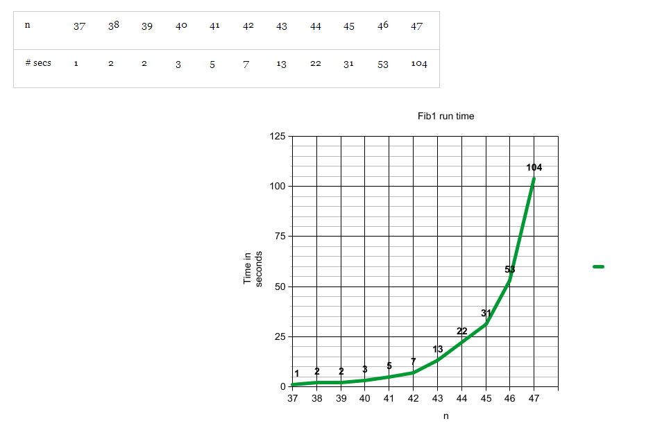

## Mở bài
Chắc đây là câu hỏi mà nhiều bạn đã gặp: "Hãy viết chương trình tính số fibonacy". Có thể nói đây là chương trình vỡ lòng khi được học về giải thuật đệ quy. Bài toán trên có thể được giải với đoạn code Python đơn giản sau:

```Python
def fibo(n):
    if n < 2:
      return n
    return fibo(n-1) + fibo(n-2)
```

Rất đơn giản, phải vậy không? Nhưng các bạn đã thử tính số fibonacy thứ 100 từ giải thuật trên chưa?
Dưới đây là thử nghiệm trên laptop 2.53 GHz Intel Core 2 Duo với 4GB RAM mà tôi đã cóp nhặt trên blog [khoa học máy tính](http://procul.org/blog):


Nguồn: http://procul/blog/

Bạn có thể dễ dàng nhận thấy thời gian tính tăng lên gấp đôi sau mỗi lần `n` tăng lên 1. Vậy sẽ mất bao lâu để tính `fibo(100)`? Theo như biểu đồ trên thì chúng ta mất khoảng 2^60 s (lớn hơn tuổi thọ của vụ trụ 15 tỉ năm).

Vậy để tính được `fibo(100)` ta cần phải sử dụng một thuật toán khác hoặc tối ưu lại cách cài đặt ở trên. Hãy quan sát thuật toán trên một chút, ví dụ để tính `fibo(10)`:

```
fibo(10) = fibo(9) + fibo(8)
         = (fibo(8) + fib(7)) + fibo(8)
         = ...
```

Ta thấy rằng `fibo(8)` được gọi 2 lần, `fibo(7)` được gọi 3 lần, tương tự `fibo(6)` được gọi 4 lần, ...

Vậy thay vì tính lại những số fibonacy trước đó, sao ta không lưu lại (cached) những số đã tính. Mỗi lần hàm gọi hàm ta sẽ kiểm tra xem số đấy có trong cached hay chưa, nếu có thì trả vể còn không thì gọi đệ quy và lưu kết quả tính được vào cache. Kỹ thuật này được gọi là đệ quy có nhớ.

```Python
F = [None] * 1000

def fibo(n):
    if F[n] is not None:
        return F[n]
    if n < 2:
      F[n] = n
      return n
    s = fibo(n-1) + fibo(n-2)
    F[n] = s
    return s
```

Sau khi tối ưu, chương trình trên hết không đầy 1s để tính `fibo(100)` trên con laptop cùi i5 của tôi. Thật tuyệt phải không nào.
