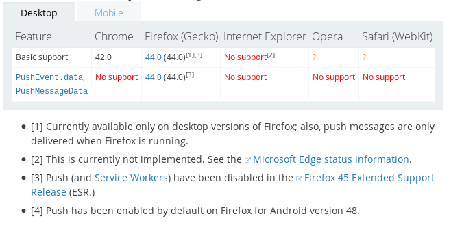
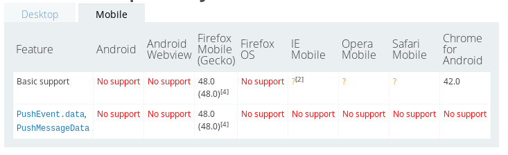
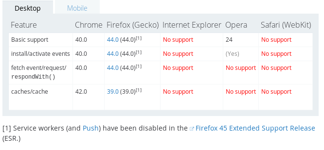
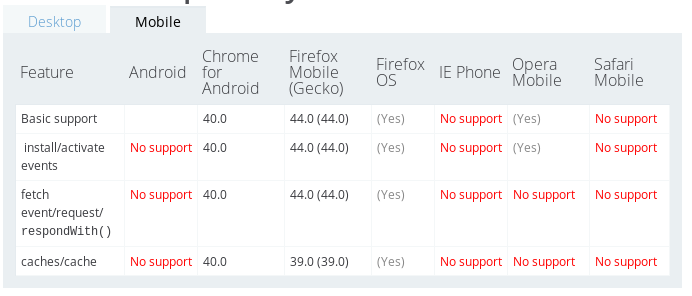
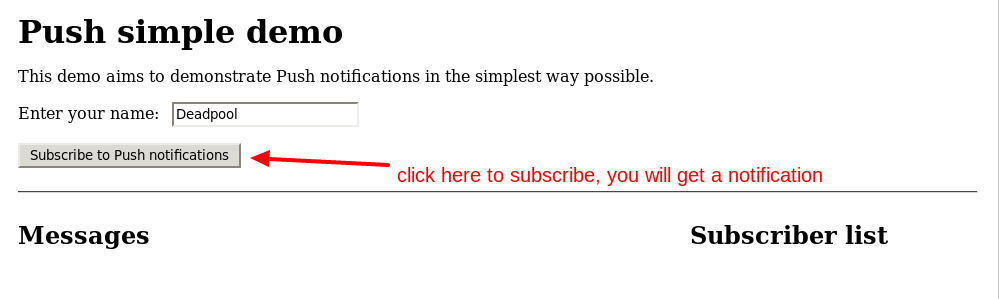
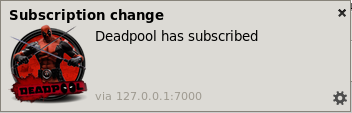
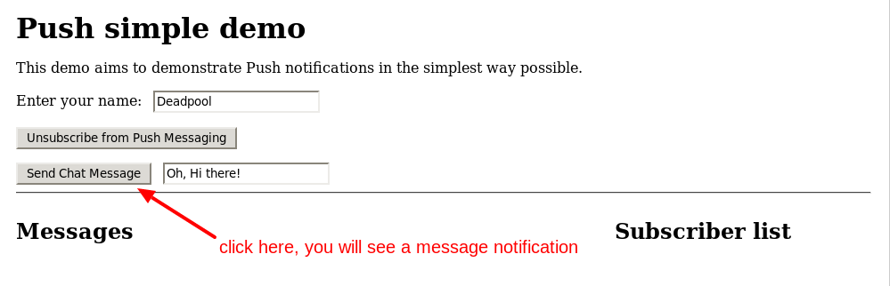
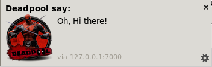
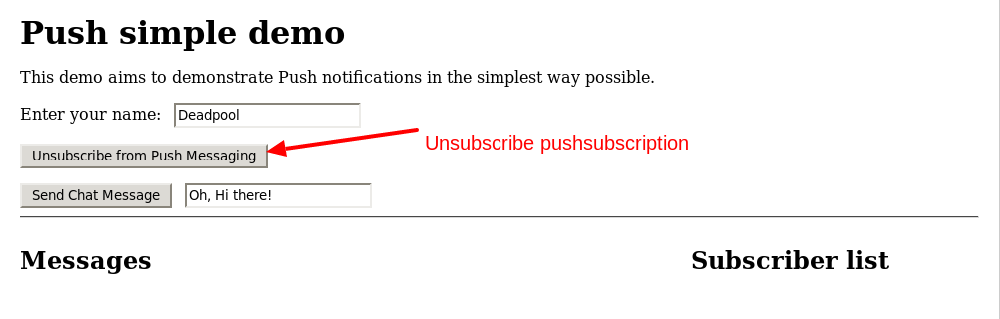

# Web Push Notifications Technology

## Introduction

### What is web Push Notifications?
If you ask a room of developers what mobile device features are missing from the web,
push notifications are always high on the list.

Web push notifications allow users to opt-in to timely updates
from sites they love and allow you to effectively re-engage them with customized, relevant content.

![push message mobile][4]

![push message icon][5]

The Push API enables sending of a push message to a webapp via a push service.
An application server can send a push message at any time, even when a webapp or user agent is inactive.
The push service ensures reliable and efficient delivery to the user agent.
Push messages are delivered to a Service Worker that runs in the origin of the webapp,
which can use the information in the message to update local state or display a notification to the user.

**Two technologies**

Push and notification use different, but complementary, APIs:
 * [push][1] is invoked when a server supplies information to a service worker;
 * a [notification][2] is the action of a service worker or web page script showing information to a user.

### How it work?

There are actually two servers involved in sending a message: your server and a third party messaging server.
You keep track of two things: recipients and recipient-specific endpoints on the messaging server.
The messaging server handles the routing.

![web push flow][3]


 1. A device downloads your web app containing an already created publicKey, referred to in scripts as the applicationServerKey. Your web app installs a service worker.

 2. During the subscription flow the browser contacts the messaging server to create a new subscription and returns it to the app.

    *Note: You don't need to know the URL of the message server. Each browser vendor manages it's own message server for its browser.*

 3. After the subscription flow, your app passes a subscription object back to your app server.
 
 4. At some later point, your app server sends a message to the messaging server, which forwards it to the recipient.

## Browsers support

### Push API (Chrome 40+, Firefox 44+)

1. Desktop

  

2. Mobile

  

References: [mozilla][7] and [icanuse][8]

### Service Worker API (Chrome 40+, Firefox 44+)

1. Desktop

  

2. Mobile

  

References: [mozilla][9] and [icanuse][10]


## FAQ

1. **Which browsers support the web push notification API?**

 *Answer: Chrome (42.0+), Firefox (44.0+)*

 *References: https://developer.mozilla.org/en-US/docs/Web/API/Push_API#Browser_compatibility*

2. **Are the push messages encrypted?**

 *Answer: Yes, To send data via a push message, it needs to be encrypted by a public key*

 *References: https://tools.ietf.org/html/draft-ietf-webpush-encryption-01*

3. **Can we set notification ring tone and icons?**

 *Answer: Currently, we CAN set many icons for notifications, but CANNOT set ring tone*

 *References: https://developer.mozilla.org/en-US/docs/Web/API/notification/sound#Browser_compatibility*

4. **How long does the push messages take to be delivered from server to user agents?**

 *Answer: It depends on the network flow (HTTPS) between "the web server and user agents"*
 *And "the service worker server and user agents"*

## Demo code

This [Push Notification demo][6] written in Typescript.

This demo run well on browsers: Firefox 51.0.1 (64 bit) and Google Chrome 55.0.2883.87 (64-bit)

**Chrome note: You have to run Chrome with the option "--ignore-certificate-errors",
because the backend server uses a self-signed certificate**

```bash
$ google-chrome --ignore-certificate-errors
```

1. Subscribe to get push notification:

  

  

2. Send message to the backend server, then the server push the message to service worker:

  

  

3. Unscribe a push notification:

  

  


## References
* https://developers.google.com/web/fundamentals/engage-and-retain/push-notifications/
* [Matt Gaunt's Push Notifications on the Open Web](https://developers.google.com/web/updates/2015/03/push-notifications-on-the-open-web)
* Push API: https://developer.mozilla.org/en-US/docs/Web/API/Push_API
* Notification API: https://developer.mozilla.org/en-US/docs/Web/API/Notifications_API
* Service worker API: https://developer.mozilla.org/en-US/docs/Web/API/Service_Worker_API
* Sample code: https://github.com/GoogleChrome/samples/tree/gh-pages/push-messaging-and-notifications

[1]: https://developer.mozilla.org/en-US/docs/Web/API/Push_API
[2]: https://developer.mozilla.org/en-US/docs/Web/API/Notifications_API
[3]: https://developers.google.com/web/fundamentals/engage-and-retain/push-notifications/images/push-flow.gif
[4]: https://developers.google.com/web/fundamentals/engage-and-retain/push-notifications/images/cc-good.png
[5]: https://developers.google.com/web/fundamentals/engage-and-retain/push-notifications/images/pete-replied.png
[6]: https://github.com/minma/labs/tree/master/web-push-demo
[7]: https://developer.mozilla.org/en/docs/Web/API/Push_API#Browser_compatibility
[8]: http://caniuse.com/#feat=push-api
[9]: https://developer.mozilla.org/en-US/docs/Web/API/Service_Worker_API#Browser_compatibility
[10]: http://caniuse.com/#feat=serviceworkers
